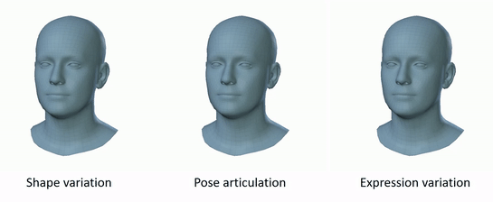

# FLAME: Articulated Expressive 3D Head Model (PyTorch)

This is an implementation of the [FLAME](http://flame.is.tue.mpg.de/) 3D head model in PyTorch.

We also provide [Tensorflow FLAME](https://github.com/TimoBolkart/TF_FLAME), a [Chumpy](https://github.com/mattloper/chumpy)-based [FLAME-fitting repository](https://github.com/Rubikplayer/flame-fitting), and code to [convert from Basel Face Model to FLAME](https://github.com/TimoBolkart/BFM_to_FLAME).

<p align="center"> 

</p>

FLAME is a lightweight and expressive generic head model learned from over 33,000 of accurately aligned 3D scans. FLAME combines a linear identity shape space (trained from head scans of 3800 subjects) with an articulated neck, jaw, and eyeballs, pose-dependent corrective blendshapes, and additional global expression blendshapes. For details please see the following [scientific publication](https://ps.is.tuebingen.mpg.de/uploads_file/attachment/attachment/400/paper.pdf)

```bibtex
Learning a model of facial shape and expression from 4D scans
Tianye Li*, Timo Bolkart*, Michael J. Black, Hao Li, and Javier Romero
ACM Transactions on Graphics (Proc. SIGGRAPH Asia) 2017
```

and the [supplementary video](https://youtu.be/36rPTkhiJTM).

## Installation

This project requires **Python 3.8 or newer**.

### Setup FLAME PyTorch Virtual Environment

```shell
python -m venv .venv
```

Activate the environment:

```shell
# Windows PowerShell
.venv\Scripts\Activate.ps1

# macOS / Linux
source .venv/bin/activate
```

### Install requirements

```shell
python -m pip install -r requirements.txt
python -m pip install -e .
mkdir model
```

## Download models

* Download FLAME model from [here](http://flame.is.tue.mpg.de/). You need to sign up and agree to the model license for access to the model. Copy the downloaded model inside the **model** folder. 
* Download Landmark embeddings from [RingNet Project](https://github.com/soubhiksanyal/RingNet/tree/master/flame_model). Copy it inside the **model** folder. 

## Project Workflow

The current project workflow is centered around `generate_from_parameters.py`
along with the measurement and appearance helper modules in this directory.

Run the main generation script from the terminal:

```shell
python generate_from_parameters.py
```

## License

FLAME is available under [Creative Commons Attribution license](https://creativecommons.org/licenses/by/4.0/). By using the model or the code, you acknowledge that you have read the license terms (https://flame.is.tue.mpg.de/modellicense.html), understand them, and agree to be bound by them. If you do not agree with these terms and conditions, you must not use the code.

## Referencing FLAME

When using this code in a scientific publication, please cite

```bibtex
@article{FLAME:SiggraphAsia2017,
  title = {Learning a model of facial shape and expression from {4D} scans},
  author = {Li, Tianye and Bolkart, Timo and Black, Michael. J. and Li, Hao and Romero, Javier},
  journal = {ACM Transactions on Graphics, (Proc. SIGGRAPH Asia)},
  volume = {36},
  number = {6},
  year = {2017},
  url = {https://doi.org/10.1145/3130800.3130813}
}
```

Additionally if you use the pose dependent dynamic landmarks from this codebase, please cite 

```bibtex
@inproceedings{RingNet:CVPR:2019,
title = {Learning to Regress 3D Face Shape and Expression from an Image without 3D Supervision},
author = {Sanyal, Soubhik and Bolkart, Timo and Feng, Haiwen and Black, Michael},
booktitle = {Proceedings IEEE Conf. on Computer Vision and Pattern Recognition (CVPR)},
month = jun,
year = {2019},
month_numeric = {6}
}
```

## Supported Projects

FLAME supports several projects such as

* [CoMA: Convolutional Mesh Autoencoders](https://github.com/anuragranj/coma)
* [RingNet: 3D Face Shape and Expression Reconstruction from an Image without 3D Supervision](https://github.com/soubhiksanyal/RingNet)
* [VOCA: Voice Operated Character Animation](https://github.com/TimoBolkart/voca)
* [Expressive Body Capture: 3D Hands, Face, and Body from a Single Image](https://github.com/vchoutas/smplify-x)
* [ExPose: Monocular Expressive Body Regression through Body-Driven Attention](https://github.com/vchoutas/expose)
* [GIF: Generative Interpretable Faces](https://github.com/ParthaEth/GIF)
* [DECA: Detailed Expression Capture and Animation](https://github.com/YadiraF/DECA)

FLAME is part of [SMPL-X: : A new joint 3D model of the human body, face and hands together](https://github.com/vchoutas/smplx)

## Contact

If you have any questions regarding the PyTorch implementation then you can contact us at soubhik.sanyal@tuebingen.mpg.de and timo.bolkart@tuebingen.mpg.de.

## Acknowledgements

This repository is built with modifications from [SMPLX](https://github.com/vchoutas/smplx).
